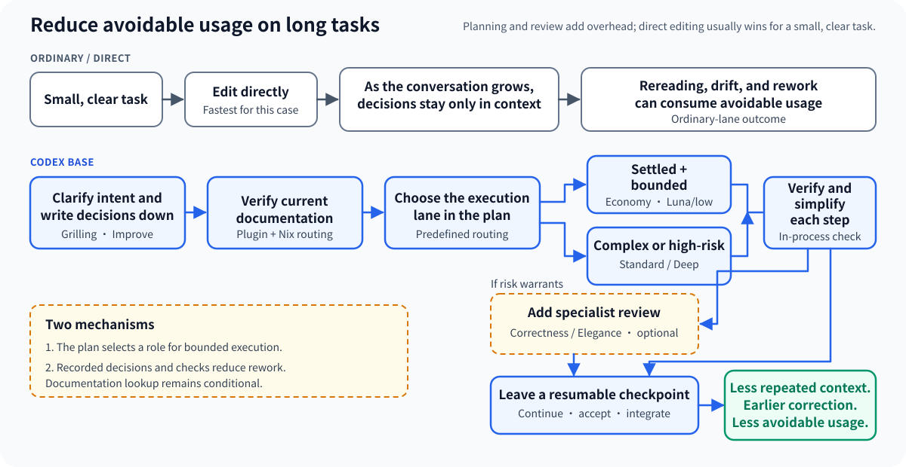

[简体中文](README.zh-CN.md)

<p align="center"></p>

# Codex Base

Long coding tasks waste model usage when they repeatedly rebuild context, drift from settled intent, or rework over-engineered changes. Codex Base is designed to reduce that avoidable usage.

[](https://github.com/bioinformatist/codex-base/actions/workflows/ci.yml)
[](LICENSE)



## How Codex Base addresses usage

| Usage concern | Mechanism |
|---|---|
| Main-model capacity | Qualifying, tightly bounded implementation can use the predefined Spark executor. [Codex-Spark is a separate model with its own usage limits](https://learn.chatgpt.com/docs/agent-configuration/speed); access and the plan's routing criteria still apply. |
| Avoidable work across the task | Decisions are written down early, documentation is checked before implementation, and every code-changing step is verified and simplified. This reduces repeated long-context reads, drift, over-engineering, and rework. |

Planning and review also use capacity. A small, clear edit is usually better handled directly, and Codex Base does not promise fewer tokens, lower cost, or less usage for every task.

## More than upstream Improve

[shadcn Improve](https://github.com/shadcn/improve) supplies the audit playbook and plan-template foundations. Codex Base builds a controlled execution and review lifecycle around them:

- plans are persisted early with semantic anchors, so settled intent survives a long task;
- every plan selects Spark, standard, or deep execution deterministically;
- an isolated executor starts without the planning conversation and receives a bounded, self-contained plan;
- exact candidate identity and bounded recovery keep later review attached to the implementation that produced it;
- each code- or test-changing step verifies first, then checks in-process for unnecessary complexity;
- one final Ponytail pass looks for what can still be deleted or replaced with native facilities;
- correctness and elegance reviews run only when their risks are present; and
- explicit checkpoint, acceptance, and integration states leave the result resumable without treating it as already shipped.

## Choose an installation

| Installation | Codex plugin | Nix / Home Manager full environment |
|---|---|---|
| Bundled engineering skills | Namespaced, such as `$codex-base:improve` | Unnamespaced, such as `$improve` |
| Improve runners | Bundled; Linux tools required | Packaged `codex-improve-*` commands |
| Global guidance, MCP routing, GitHub MCP | No | Yes |
| Mintlify / Context7 routing | No | Yes |
| Codex, Code Mode Host, Node, Playwright CLI | No | Pinned packages |

The [capability catalog](docs/capabilities.md) lists every trigger, responsibility, verification surface, and provenance. The plugin does not install Nix-only capabilities, commands, secrets, or global configuration.

The full Nix / Home Manager environment currently pins Codex 0.153.0 and Code Mode Host.

## Quick start, including Windows

Plugins currently require a new Codex session after installation and are not available in the Codex IDE extension. Use the Codex CLI for this workflow.

- Linux users need Bash, GNU coreutils, Git, GNU sed, jq, and Codex on `PATH`.
- Windows users can use portable skills from a compatible Codex CLI environment. For the complete Improve runners and Nix/Home Manager environment, use WSL2 and keep the repository in the Linux filesystem, such as `~/src`, not `/mnt/c`.
- Native Windows Improve runners and Windows CI are not provided here.

```console
codex plugin marketplace add https://github.com/bioinformatist/codex-base
codex plugin add codex-base@bioinformatist-codex
```

### Verify the installation

```console
codex plugin list --marketplace bioinformatist-codex
```

The output should show `codex-base@bioinformatist-codex` installed and enabled. Then start a **new Codex session** and make a harmless functional check on disposable prose:

```text
Use $codex-base:stop-slop to tighten this disposable sentence without changing its facts.
```

## First workflows

Clarify a decision before acting:

```text
Use $codex-base:grilling to stress-test this API boundary before implementation.
```

Run a read-only audit:

```text
Use $codex-base:improve quick to audit this repository.
```

Persist a reviewed plan:

```text
Use $codex-base:improve plan <request>.
```

> [!NOTE]
> Run `$improve plan ...` (or the portable plugin form `$codex-base:improve plan ...`) in normal/default collaboration mode, not built-in Plan Mode. Plan Mode is read-only, so Improve cannot persist intermediate plans, semantic anchors, and review records there. Writing those decisions down lets later execution avoid reconstructing them from a long conversation.

The full Nix/Home Manager installation exposes the corresponding unnamespaced `$grilling` and `$improve` skills. Add the flake input and import the module:

```nix
{
  inputs.codex-base = {
    url = "github:bioinformatist/codex-base";
    inputs.nixpkgs.follows = "nixpkgs";
  };
  imports = [ inputs.codex-base.homeManagerModules.default ];
  programs.codexBase.enable = true;
}
```

## Learn and contribute

- [Detailed capability catalog](docs/capabilities.md)
- [Credits and upstream licenses](docs/credits.md)
- [Contributing](CONTRIBUTING.md)
- [Architecture](docs/architecture.md) and [updating](docs/updating.md)
- [Plugin versus Nix choice](#choose-an-installation)
- [MIT License](LICENSE)
