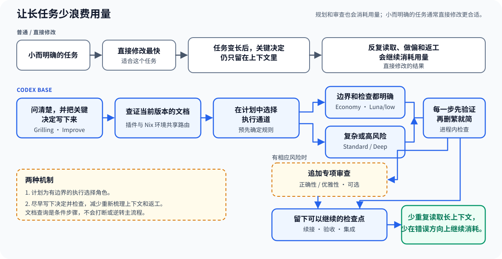

[English](README.md)

<p align="center"></p>

# Codex Base

长任务经常把用量浪费在反复梳理上下文、偏离已经定下的目标，以及为过度设计返工上。Codex Base 要减少的正是这些不必要的消耗。

[](https://github.com/bioinformatist/codex-base/actions/workflows/ci.yml)
[](LICENSE)



## 用量省在哪里

| 用量问题 | Codex Base 的做法 |
|---|---|
| 主模型额度 | 边界和检查都已明确的实现任务，可以按计划交给预先指定的 Spark 执行器。[Codex-Spark 是独立模型，有自己的用量限制](https://learn.chatgpt.com/docs/agent-configuration/speed)；能否使用仍取决于访问权限和计划中的通道条件。 |
| 长任务中的重复消耗 | 尽早写下决定，实现前查证文档，每个改动步骤都先验证、再删繁就简，从而减少反复读取长上下文、做偏、过度设计和返工。 |

规划和审查也会消耗用量。小而明确的改动通常直接做更合适；Codex Base 不承诺每项任务都会减少 token、降低费用或减少总用量。

## 不只是把 Improve 搬过来

[shadcn Improve](https://github.com/shadcn/improve) 提供了审计方法和计划模板基础。Codex Base 在此之上补上了执行、审查和续接机制：

- 尽早保存计划和语义锚点，让已经定下的目标不随长任务丢失；
- 在计划中按明确规则选择 Spark、standard 或 deep 执行通道；
- 由隔离的执行器只接收边界完整的计划，不依赖规划时的对话；
- 每次实现都能准确对应到一个候选版本；恢复操作只在明确的范围内尝试有限次数，因此后续审查始终对应产生它的那次实现；
- 每个代码或测试改动步骤都先验证，再在当前进程里检查能否删减；
- 最后固定运行一次 Ponytail，继续寻找可删除或可由原生能力替代的复杂度；
- 只有确有相应风险时，才追加正确性或优雅性审查；
- 明确区分检查点、验收和集成状态，结果可以续接，但不会被误当成已经发布。

## 选择安装方式

| 安装方式 | Codex 插件 | Nix / Home Manager 完整环境 |
|---|---|---|
| 内置工程技能 | 带命名空间，例如 `$codex-base:improve` | 无命名空间，例如 `$improve` |
| Improve 执行器 | 随技能打包；需要 Linux 工具 | 打包为 `codex-improve-*` 命令 |
| 全局指引、MCP 路由、GitHub MCP | 无 | 有 |
| Mintlify / Context7 路由 | 无 | 有 |
| Codex、Code Mode Host、Node、Playwright CLI | 不安装 | 固定版本的软件包 |

[详细能力目录](docs/capabilities.zh-CN.md)列出了每项能力的触发条件、职责、验证方式与来源。Codex 插件不会安装仅属于 Nix / Home Manager 完整环境的能力、命令、密钥或全局配置。

Nix / Home Manager 完整环境当前固定 Codex 0.153.0 和 Code Mode Host。

## 快速开始（含 Windows）

目前安装插件后需要新建 Codex 会话，且 Codex IDE 扩展尚不支持插件。请用 Codex CLI 运行这套工作流。

- Linux 用户需要 `PATH` 中已有 Bash、GNU coreutils、Git、GNU sed、jq 和 Codex。
- Windows 用户可在兼容的 Codex CLI 环境使用可移植技能。若要运行完整 Improve 执行器及 Nix / Home Manager 完整环境，请使用 WSL2，并把仓库放在 Linux 文件系统中（例如 `~/src`），不要放在 `/mnt/c` 下。
- 本仓库不提供原生 Windows Improve 执行器或 Windows CI。

```console
codex plugin marketplace add https://github.com/bioinformatist/codex-base
codex plugin add codex-base@bioinformatist-codex
```

### 验证安装

```console
codex plugin list --marketplace bioinformatist-codex
```

输出应显示 `codex-base@bioinformatist-codex` 已安装且已启用。然后新建一个 **Codex 会话**，对可丢弃文字做一次无副作用的功能验证：

```text
使用 $codex-base:stop-slop 精简下面这句临时文本，不要改变其中的事实。
```

## 首次工作流

在行动前澄清决定：

```text
使用 $codex-base:grilling，在实现前帮我检验这个 API 边界是否合理。
```

运行一次只读审计：

```text
使用 $codex-base:improve quick 对这个仓库做一次只读审计。
```

保存一份经过审查的计划：

```text
使用 $codex-base:improve plan 为 <request> 制订并保存计划。
```

> [!NOTE]
> 请在普通/默认协作模式中运行 `$improve plan ...`（Codex 插件写法为 `$codex-base:improve plan ...`），不要使用内置 Plan Mode。Plan Mode 是只读的，Improve 无法在其中写入中间计划、语义锚点和审查记录。把这些决定写下来，后续执行才不必从很长的对话中重新梳理。

Nix / Home Manager 完整环境会提供对应的无命名空间 `$grilling` 与 `$improve` 技能。添加 flake 输入并导入模块：

```nix
{
  inputs.codex-base = {
    url = "github:bioinformatist/codex-base";
    inputs.nixpkgs.follows = "nixpkgs";
  };
  imports = [ inputs.codex-base.homeManagerModules.default ];
  programs.codexBase.enable = true;
}
```

## 了解更多与参与贡献

- [详细能力目录](docs/capabilities.zh-CN.md)
- [上游致谢与许可证](docs/credits.md)
- [贡献指南](CONTRIBUTING.md)
- [架构](docs/architecture.md)与[更新说明](docs/updating.md)
- [Codex 插件与 Nix / Home Manager 的选择](#选择安装方式)
- [MIT 许可证](LICENSE)
